# Design and Implementation of Role playing game using MVC architecture - Dungeon Master.

## Overview
The world for our game consists of a dungeon, a network of tunnels and caves that are interconnected so that player can explore the entire world by traveling from cave to cave through the tunnels that connect them.
A cave may or may not have treasure and the player has the ability to collect these treasure. The user has the capacity to control the player in the dungeon by giving directions in which the player should move.
A location in the dungeon can have upto four directions such as North, South, East, and West. A player can move in any direction available at the given location.
Caves may have weapons that the player can pick on his journey. Dungeon will have at least one monster which the player must win against to win the game.
Player can kill the monster by shooting the arrow.

## List of features
- Construct a dungeon with different degrees of interconnectivity, and they can either be wrapped or non-wrapped.
- Provide support for at least three types of treasure: diamonds, rubies, and sapphires
- Treasure to be added to a specified percentage of caves. For example, the client should be able to ask the model to add treasure to 20% of the caves and the model should add a random treasure to at least 20% of the caves in the dungeon. A cave can have more than one treasure.
- A player to enter the dungeon at the start
- Provide a description of the player that, at a minimum, includes a description of what treasure the player has collected
- Provide a description of the player's location that at the minimum includes a description of treasure in the room and the possible moves (north, east, south, west) that the player can make from their current location
- A player to move from their current location.
- There should be a path from every cave in the dungeon to every other cave in the dungeon.
- A player to pick up treasure that is located in their same location
- One cave is randomly selected as the start and one cave is randomly selected to be the end. The path between the start and the end locations should be at least of length 5.
- Player will be equipped with a bow and 3 arrow at start of the game.
- Monster are added to the caves
- Player can detect smell, shoot, and pickup weapons.
- Player has health feature being monitored during the game.
- Monster are injured when hit with an arrow once, killed on the second hit.
- The percentage of weapons is same as the percentage of treasure.
- Dungeon must always have at least one monster. There must always be a monster at ending cave.
- If player enter a cave when the monster is alive, the player will be eater by the monster.
- There is 50% chance that player would survive when monster is injured.
- Arrows and treasure can be, but are not always, found together. Furthermore, arrows can be found in both caves and tunnels.
- A player that has arrows, can attempt to slay a monster by specifying a direction and distance in which to shoot their crooked arrow. 
- Distance is defined as the number of caves (but not tunnels) that an arrow travels. Arrows travel freely down tunnels (even crooked ones) but only travel in a straight line through a cave.
- Decide the difficulty level of the game by the number of monsters in the dungeon.
- MVC model provides a GUI view application to play the game using mouse clicks and keyboard keys to navigate the dungeon, pick up treasure and arrows, attack monsters etc.

## Design - Model-View-Controller Architecture
#### Graphical User Interface based Application.
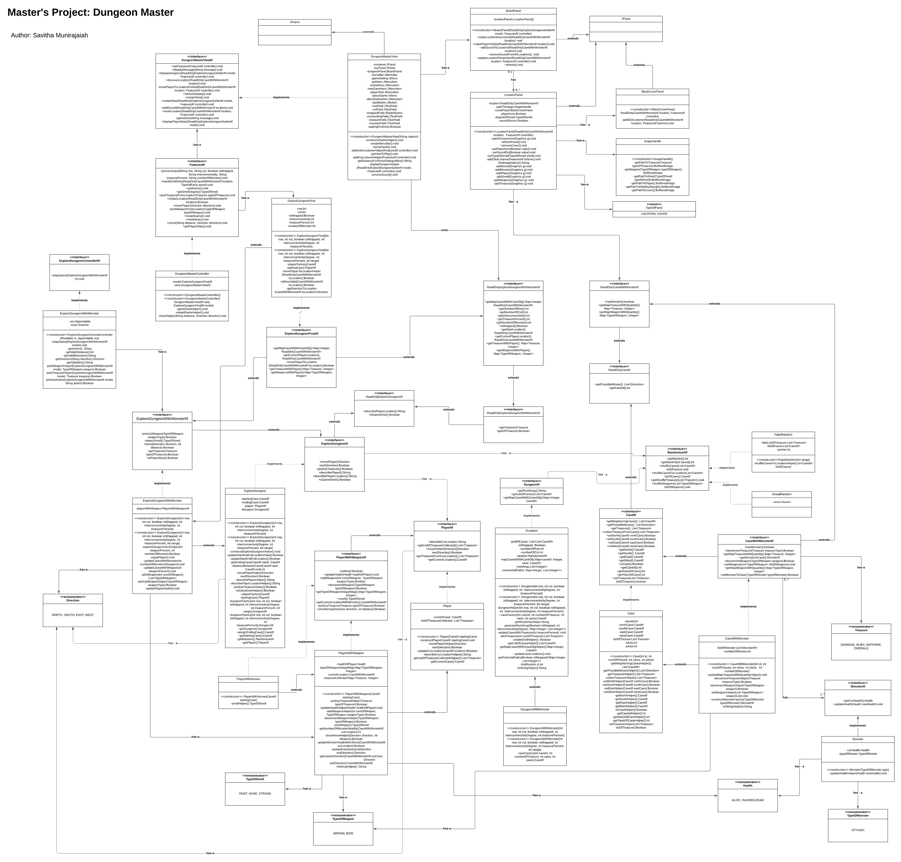

## How to Run
Open the command prompt, cd to the location where jar file is saved and run the jar file using the below command.

### To launch the GUI application:
> java -jar DungeonMasterMVC.jar   

### To launch the text-based console application:
> java -jar DungeonMasterMVC.jar [row] [col] [isWrapped] [interconnectivityDegree] [percentageOfTreasure] [difficultyLevel]

Input arguments format:
rows, cols, isWrapped, interconnectivityDegree, percentageOfTreasure, difficultyLevel

### How to Use the Program

The driver class overall explains on how to use the program. However, the steps below will summarize them all.

- Driver class that demonstrates the usage of the model.
 1. Create a game scenario in 2 ways:
    1. By providing necessary details as command line arguments, this will launch a text-based console application.
    2. When no command lines are provided, a graphical-user interface [GUI] application is launched to play the game with visual representation.
 2. Instruction for a GUI based application:
    1. On the first page, enter all the parameter requested to create the dungeon.
    2. Number of row is an integer field that represents the number of rows in the dungeon.
    3. Number of columns is an integer field that represents the number of columns in the dungeon.
    4. Interconnectivity degree is an integer field that tells how well-connected are the locations in the dungeon.
    5. Percentage of the treasure determines the degree of different treasure the player can find in the dungeon.
    6. Difficulty level determines the number of monsters in the dungeon.
    7. If isWrapped is selected then the location on the edges of the dungeon are connected else they are not.
    8. Navigate the player through the dungeon using arrow-keys on keyboard or mouse clicks in a GUI based application.
    9. Player can detect smell when monster is around and this is represented by a greed fog. 
       1. If the fog is darker, then the smell is strong.
       2. If the green fod is lighter, then the smell is faint.
    10. When the monster is shot, it makes a loud noise. This is represented by a text [GRRR...] on the player's location. It vanishes when player takes another shot or any other actions.
    11. Use key 'F' to shoot an arrow, use arrow keys on the keyboard to provide direction and provide a distance.
    12. Key 'D' to pick up diamond.
    13. Key 'S' to pick up Sapphire. 
    14. Key 'R' to pick up Ruby.
    15. Key 'E' to pick up Emerald.
    16. Key 'A' to pick up Arrow.
    17. Use Menu-Bar to navigate different options.
        1. Restart the game with same features.
        2. Start a NewGame with new features, this will take the player out of the current game scenario.
        3. Quit game will close the application.
        4. PlayerStats provides the description of the player's current status in the game.
        5. About provides the instructions to play the game.
 3. Navigate the player through the dungeon using text-commands [N-north, S-south, E-east, W-west] in a console based application.
 4. If current location has some treasure you may choose to collect.
 5. If current location has weapons you may choose collect.
 6. Player can smell something bad usually when monster is closer to your location.
 7. You may choose to shoot an arrow by giving a direction and distance.
 8. When a monster is shot, it makes loud noise.
 9. Monster is injured when hit once, it dies when hit two times.
 10. When you reach an end cave alive, you will be declared as the Dungeon Master!

## Description of Example Runs 
#### GUI based Application.
##### Entry screen where features are entered.  
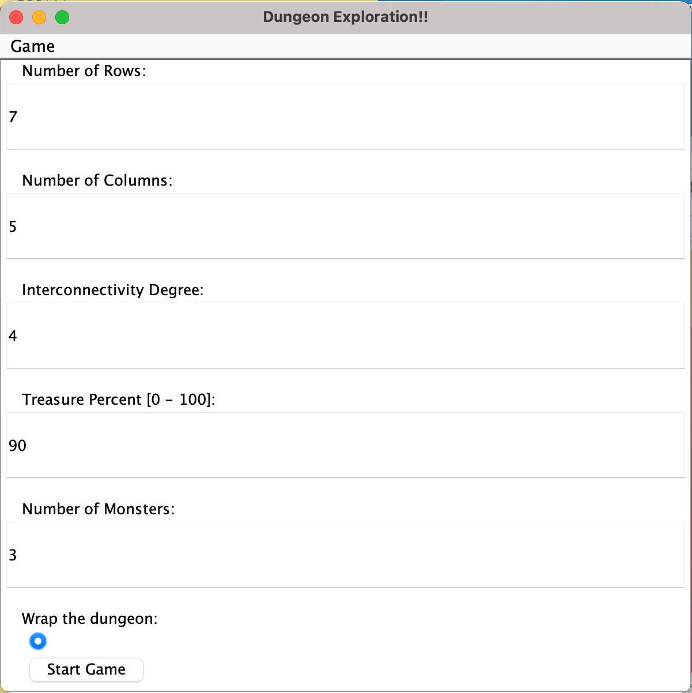

##### Game start screen and player's initial equipments.
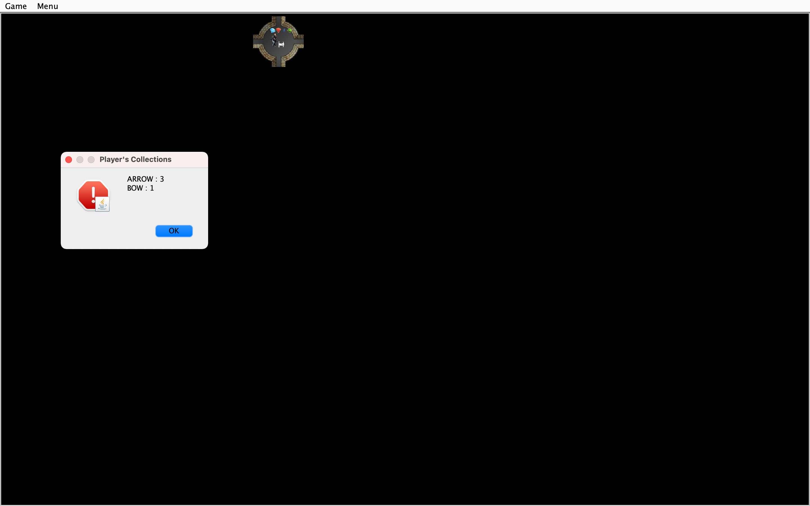

##### Instruction about how to play the game.
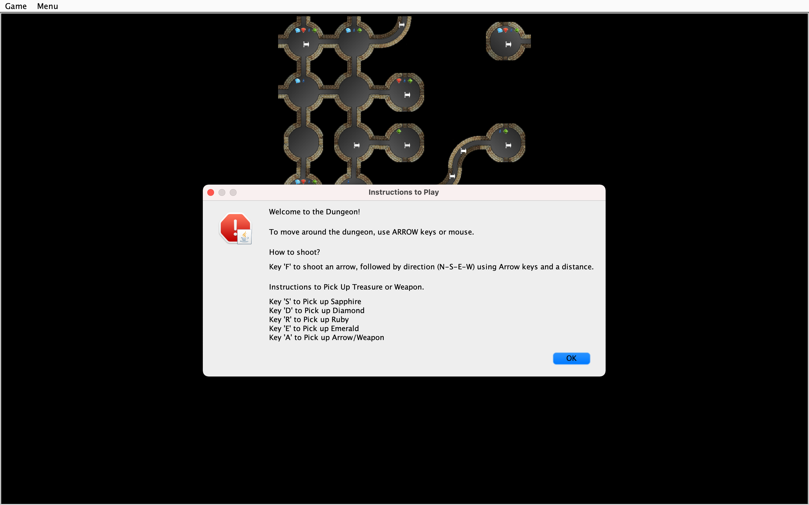

##### Menu Items for Restart, New Game, and Player's Collections.
Observe the visual representation of elements found in each location.
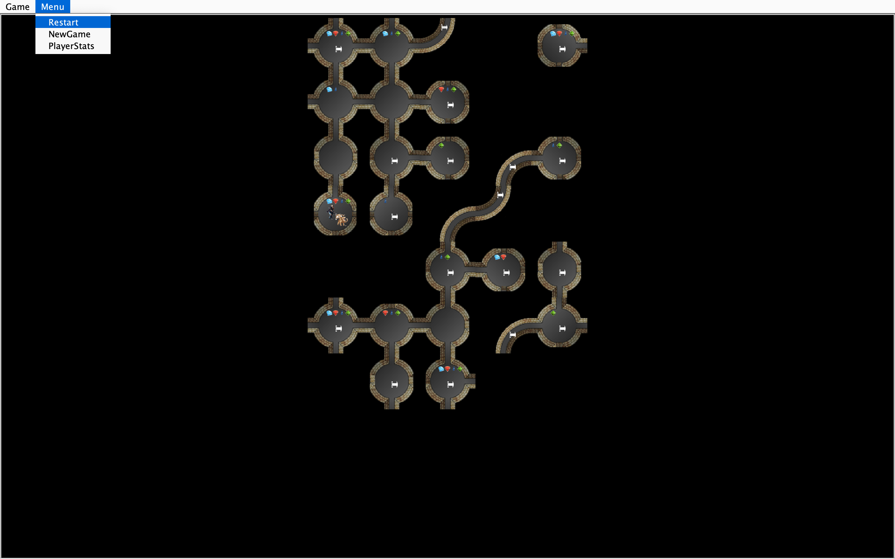

##### Player wins.
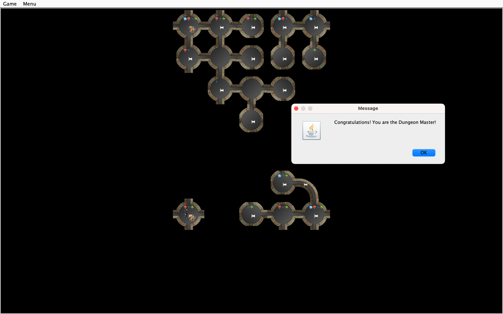

##### Player is killed and game ends.
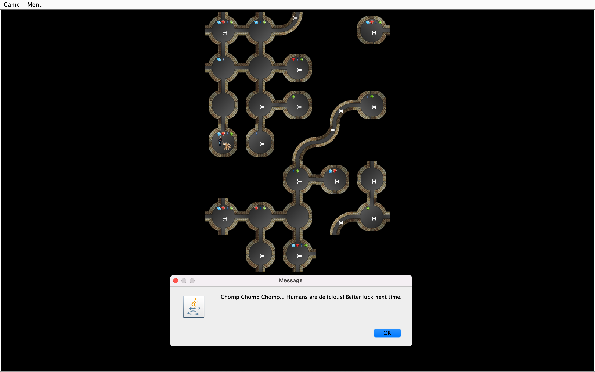

##### Shoot instruction to provide direction.
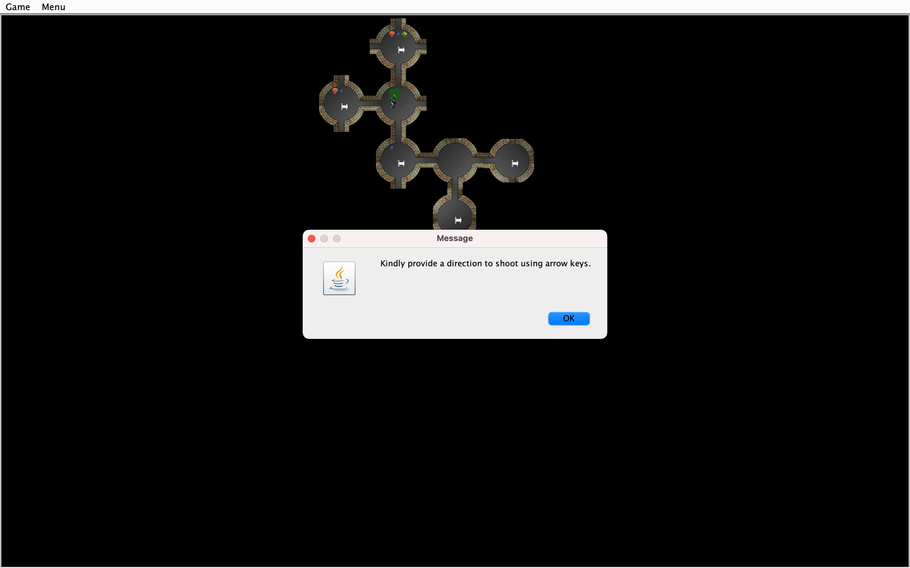

##### Distance to shoot and Player's ability to smell.
Observer that player can smell something strong from this location is indicated by a green fog above the player.
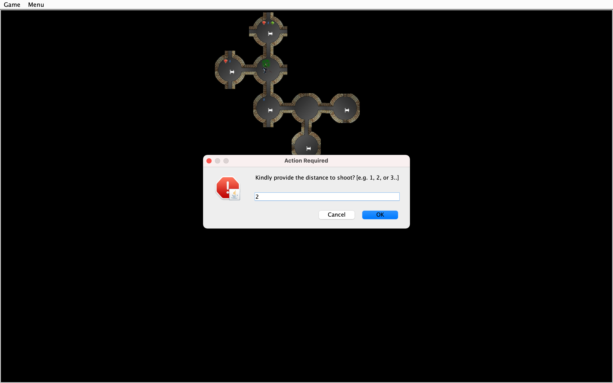

##### Player's ability to hear sound.
The sound the player hears is represented by a text [GRRR..].
This is heard when player shoots an arrow at the monster successfully.
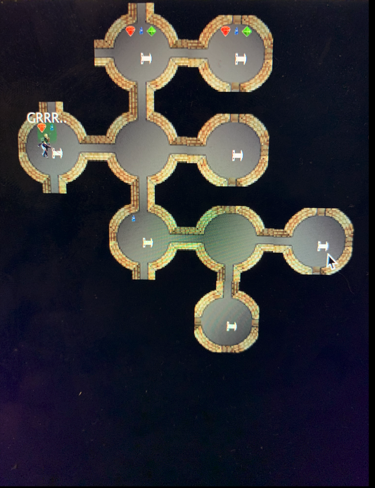

##### Scroll bar and Game menu which contains Quit and About.
Observe the monster on the screen.
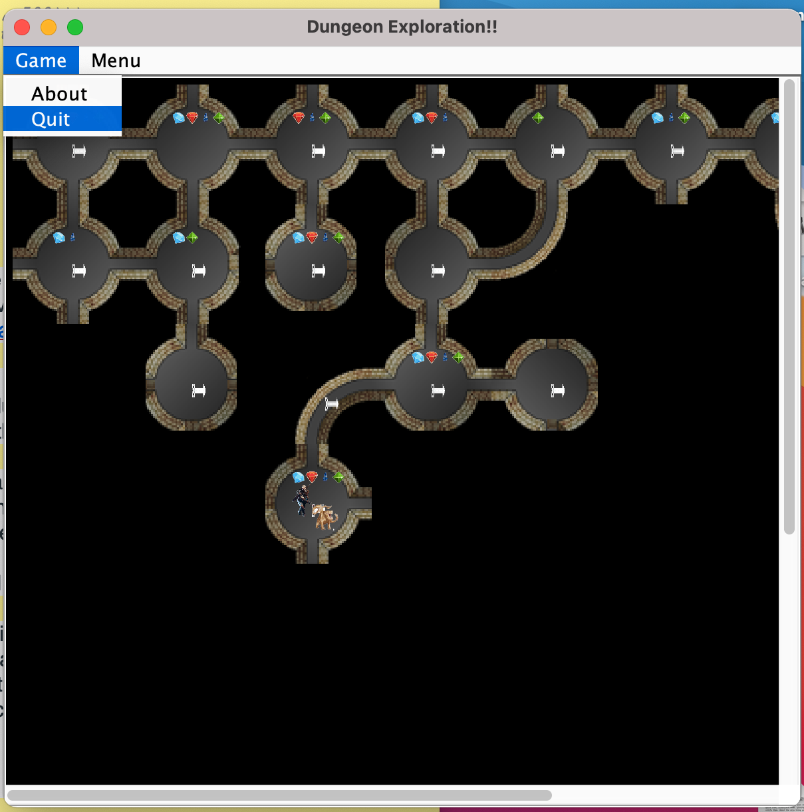

#### Text-Based Console Application.
######playerWinsAfterKillingMonster.txt file description.
Command line arguments:
src % javac driver/DriverExploreDungeon.java
src % java driver/DriverExploreDungeon.java 5 6 true 3 50 4

Input arguments format: 
rows, cols, isWrapped, interconnectivityDegree, percentageOfTreasure, difficultyLevel

#####Game play started:
*****************************************************
Welcome to the Dungeon!! You may find riches or get killed in here!
Be careful and watch your back!
*****************************************************
You smell something bad!
Treasure Found : {}
Possible Moves : [North, South, East, West]
Cave id: 0
Weapons Found : {ARROW=3} 
Pick an action!
Move, PickUp, Shoot (M-P-S)? s
Direction to aim? (N-S-E-W)
n
Distance to hit? (1 - 5)
1
Woah!! You hear a great howl!
*****************************************************
######## Player smells.
You smell something bad!
Treasure Found : {}
Possible Moves : [North, South, East, West]
Cave id: 0
Weapons Found : {ARROW=3}
Pick an action!
Move, PickUp, Shoot (M-P-S)? s
Direction to aim? (N-S-E-W)
n
Distance to hit? (1 - 5)
1
Woah!! You hear a great howl!
######## Player shoots the monster and kills it.
*****************************************************
Treasure Found : {}
Possible Moves : [North, South, East, West]
Cave id: 0
Weapons Found : {ARROW=3}
Pick an action!
Move, PickUp, Shoot (M-P-S)? s
Direction to aim? (N-S-E-W)
n
Distance to hit? (1 - 5)
1
Hmm.. You shoot an arrow into darkness.
*****************************************************
Treasure Found : {}
Possible Moves : [North, South, East, West]
Cave id: 0
Weapons Found : {ARROW=3}
Pick an action!
Move, PickUp, Shoot (M-P-S)? m
Which Direction?
n
*****************************************************
Treasure Found : {DIAMOND=2, RUBY=1, SAPPHIRE=1}
Possible Moves : [South, East, West]
Cave id: 24
Weapons Found : {ARROW=9}
Monster found and is DEAD
Pick an action!
Move, PickUp, Shoot (M-P-S)? p
What would you like to pick ?
diamond
######## Player picks up treasure from the cave.
*****************************************************
Treasure Found : {DIAMOND=1, RUBY=1, SAPPHIRE=1}
Possible Moves : [South, East, West]
Cave id: 24
Weapons Found : {ARROW=9}
Monster found and is DEAD
Pick an action!
Move, PickUp, Shoot (M-P-S)? p
What would you like to pick ?
ruby
*****************************************************
Treasure Found : {DIAMOND=1, SAPPHIRE=1}
Possible Moves : [South, East, West]
Cave id: 24
Weapons Found : {ARROW=9}
Monster found and is DEAD
Pick an action!
Move, PickUp, Shoot (M-P-S)? p
What would you like to pick ?
sapphire
*****************************************************
Treasure Found : {DIAMOND=1}
Possible Moves : [South, East, West]
Cave id: 24
Weapons Found : {ARROW=9}
Monster found and is DEAD
Pick an action!
Move, PickUp, Shoot (M-P-S)? p
What would you like to pick ?
arrow
######## Player picks weapon from the cave.
*****************************************************
Treasure Found : {DIAMOND=1}
Possible Moves : [South, East, West]
Cave id: 24
Weapons Found : {ARROW=8}
Monster found and is DEAD
Pick an action!
Move, PickUp, Shoot (M-P-S)? p
What would you like to pick ?
arrow
*****************************************************
Treasure Found : {DIAMOND=1}
Possible Moves : [South, East, West]
Cave id: 24
Weapons Found : {ARROW=7}
Monster found and is DEAD
Pick an action!
Move, PickUp, Shoot (M-P-S)? m
Which Direction?
e
*****************************************************
Treasure Found : {}
Possible Moves : [North, South, West]
Cave id: 25
Weapons Found : {}
Pick an action!
Move, PickUp, Shoot (M-P-S)? m
Which Direction?
n
######## Player navigates through the dungeon.
*****************************************************
You smell something bad!
Treasure Found : {}
Possible Moves : [North, South, East]
Cave id: 19
Weapons Found : {ARROW=7}
Pick an action!
Move, PickUp, Shoot (M-P-S)? s
Direction to aim? (N-S-E-W)
n
Distance to hit? (1 - 5)
1
Hmm.. You shoot an arrow into darkness.
*****************************************************
You smell something bad!
Treasure Found : {}
Possible Moves : [North, South, East]
Cave id: 19
Weapons Found : {ARROW=7}
Pick an action!
Move, PickUp, Shoot (M-P-S)? s
Direction to aim? (N-S-E-W)
e
Distance to hit? (1 - 5)
1
Hmm.. You shoot an arrow into darkness.
*****************************************************
You smell something bad!
Treasure Found : {}
Possible Moves : [North, South, East]
Cave id: 19
Weapons Found : {ARROW=7}
Pick an action!
Move, PickUp, Shoot (M-P-S)? s
Direction to aim? (N-S-E-W)
e
Distance to hit? (1 - 5)
2
OOPS!! No more arrows to shoot
######## Player ran out of arrows to shoot.
*****************************************************
You smell something bad!
Treasure Found : {}
Possible Moves : [North, South, East]
Cave id: 19
Weapons Found : {ARROW=7}
Pick an action!
Move, PickUp, Shoot (M-P-S)? p
What would you like to pick ?
arrow
######## Player picks up more arrows from the location.
*****************************************************
You smell something bad!
Treasure Found : {}
Possible Moves : [North, South, East]
Cave id: 19
Weapons Found : {ARROW=6}
Pick an action!
Move, PickUp, Shoot (M-P-S)? p
What would you like to pick ?
arrow
*****************************************************
You smell something bad!
Treasure Found : {}
Possible Moves : [North, South, East]
Cave id: 19
Weapons Found : {ARROW=5}
Pick an action!
Move, PickUp, Shoot (M-P-S)? p
What would you like to pick ?
arrow
*****************************************************
You smell something bad!
Treasure Found : {}
Possible Moves : [North, South, East]
Cave id: 19
Weapons Found : {ARROW=4}
Pick an action!
Move, PickUp, Shoot (M-P-S)? s
Direction to aim? (N-S-E-W)
n
Distance to hit? (1 - 5)
2
Hmm.. You shoot an arrow into darkness.
######## Player shoots but nothing was hit.
*****************************************************
You smell something bad!
Treasure Found : {}
Possible Moves : [North, South, East]
Cave id: 19
Weapons Found : {ARROW=4}
Pick an action!
Move, PickUp, Shoot (M-P-S)? m
Which Direction?
e
*****************************************************
You smell something bad!
Treasure Found : {}
Possible Moves : [North, South, East, West]
Cave id: 20
Weapons Found : {}
Pick an action!
Move, PickUp, Shoot (M-P-S)? s
Direction to aim? (N-S-E-W)
n
Distance to hit? (1 - 5)
1
Woah!! You hear a great howl!
*****************************************************
You smell something bad!
Treasure Found : {}
Possible Moves : [North, South, East, West]
Cave id: 20
Weapons Found : {}
Pick an action!
Move, PickUp, Shoot (M-P-S)? s
Direction to aim? (N-S-E-W)
n
Distance to hit? (1 - 5)
1
Woah!! You hear a great howl!
*****************************************************
Treasure Found : {}
Possible Moves : [North, South, East, West]
Cave id: 20
Weapons Found : {}
Pick an action!
Move, PickUp, Shoot (M-P-S)? m
Which Direction?
n
Game Over!
Congratulations! You are the Dungeon Master!!
######## Player reached the end location of the dungeon and survived the journey.
*********************************************
######## The weapons and treasure with the player at the end of the journey.
You current inventory contains:
Weapons: {BOW=1}
Treasure Collected : {DIAMOND=1, RUBY=1, SAPPHIRE=1}%                                                                                                                       (base) savithamunirajaiah@Savithas-MacBook-Pro src %

## Design/Model Changes

#####Project - version2
- Used Square Design pattern to extend the features of the model.
- Added a new controller implementation and interface to support GUI based application.
- Implemented the view interface to support Model-View-Controller architecture.
- Added respective package-private classes to support visual representations.
- Added a new Resource root '/images' folder that contains all the images used by the view.
- Added necessary Read-Only Interfaces to implement Observer Pattern where the view can see the changes in the model.
- Started the implementation by constructing both the view and model inside the controller but later overloaded a controller constructor to accept view and model from outside.
- Testing was done for all the new interfaces added to the model. 
- Used necessary Mock models and Mock view to test the controller.

#####Project - version1
- Extended the old interfaces to add new features into the game.
- Applied square design pattern to implement new feature with minimum modifications to old implementation.
- Added enum classes for different types of smell, health, weapons, monster etc.
- Added few package private method to ExploreDungeon class to access some parameters from its extended class.
- Used factory method to construct objects where necessary.
- Overwrote from methods to implement later representation of data such as player will now collect one treasure item per move.

## Assumptions
- Assuming that the Restart game will restart the game with same features as before.
- Assuming a player can visit a location twice.
- Assuming that MIN_PATH between start and end cave is 5.
- Assuming that if a player is moved in a direction without a pathway then the player remain in the same cave. No action taken. This assumption is made as we need to move through the graph picking random direction in a random dungeon until the player reached an end cave. This is to avoid an exception everytime an invalid direction is picked.
- Maximum 10 weapons can be assigned to a location.
- Maximum 10 treasure items can be assigned to a location.
- Player cannot shoot an arrow with 0 distance.
- A cave can have only 1 monster.
- Monster do not move in the dungeon.

## Limitations
Restarting the game will not generate the exact same dungeon as there is randomness involved while generating the dungeon and its elements.

## Citations
https://www.youtube.com/channel/UCD8yeTczadqdARzQUp29PJw - to implement breadth first search.